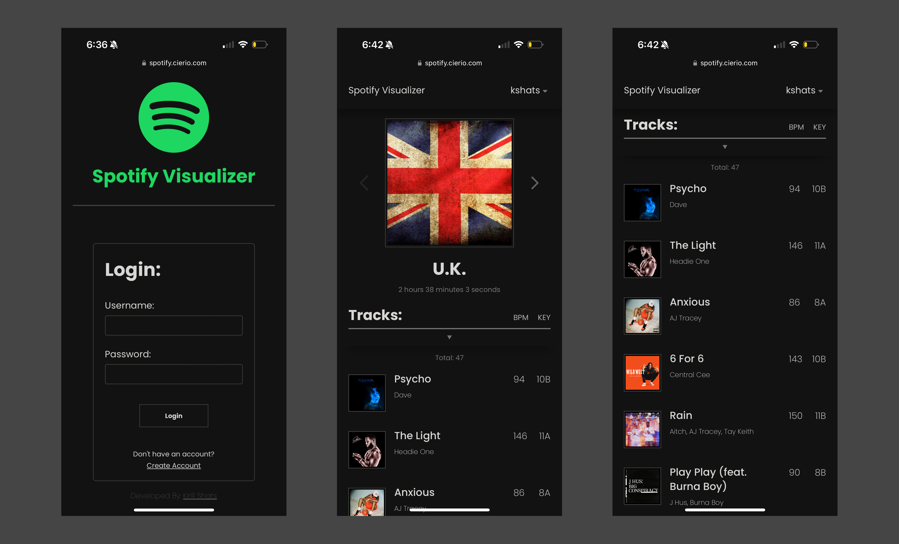

<h1 align="center">Spotify Visualizer</h1>




<div align="center">
    <a href="#demo-the-mvp">Demo the MVP</a>
</div>


## Project Description

<br>
<br>

## Tech Used

### Front End:
The front-end is entirely built from flask rendered jinja templates that contain vanilla **HTML, CSS, and Javscript**. There are plans to port this all over to REACT.js once I get around to learning the framework.
<br>

### Back End:
The backend is all built with Pythons' **Flask** web framework, which has **Plottly Dash** attached to it as well. You can view the requirements.txt file for a list of all third-party tools being used.
<br>

### Database:
At the current moment, in order to allow for faster development and pivotting **MongoDB** is being used. There might be plans to utilize mongo more as a cache and transitition data over to a SQL based database in the future, once schemas and functionality is ironed out.
<br>

### Production Infrastructure:
In production, the application is containerized and run by a **Gunicorn** server which sits behind an **Nginx** proxy server. At the moment, the mongo database that is being used is hosted with Mongo Atlas.
<br>
<br>

## Run Project Locally

### Environment Variables:

<p align="center">docker/environment.sh</p>

```
#!/bin/bash

# ------ Flask Configuration ------ #
export FLASK_SECRET_KEY="someSecretKey"
export FLASK_APP_MODE=" PROD || DEV "

# ------ Mongo ------ #
export MONGO_URI=mongodb://mongo:27017

# ------ Spotify oAuth ------ #
export SPOTIFY_CLIENT_ID="Your Spotify App Client ID"
export SPOTIFY_CLIENT_SECRET="Your Spotify App Client Secret"
export SPOTIFY_REDIRECT_URI="URL To Redirect After Spotify oAUTH"
```

<br>

Regardless, on whether you choose to run the app [Bare Metal](#bare-metal:) or with [Docker](#docker:) you will need to set the values of some environment variables in the *environment.sh* script file found in the docker directory.

<br>

**$FLASK_SECRET_KEY**

>This is a flask configuration option which is required to succesfully sign cookies for session management. You can set this to whatever you like for development purposes but in production flask says "it should be a long random bytes or str".

**$FLASK_APP_MODE**

>App mode is a flag that is used to switch the flask application between development and production modes. The possible values are either `PROD` or `DEV`. At the current moment, the only difference is that in production the flask app knows it is behind a proxy and is configured to expect proxy headers to be added to all requests.

**$SPOTIFY_CLIENT_ID**

>This deals with the spotify api authentication process. In order to be able to utilize the spotify api, you need to register and create an app. Upon creation of the app you will receive the `Client ID` which needs to be the value here. Check out the <a href="https://developer.spotify.com/documentation/web-api/tutorials/code-flow">Spotify Api Docs</a> for more detailed information.

**$SPOTIFY_CLIENT_SECRET**

> This deals with the spotify api authentication process. In order to be able to utilize the spotify api, you need to register and create an app. Upon creation of the app you will receive the `Client Secret` which needs to be the value here. Check out the <a href="https://developer.spotify.com/documentation/web-api/tutorials/code-flow#:~:text=Value-,Authorization,-Required">Spotify Api Docs</a> for more detailed information.

**$SPOTIFY_REDIRECT_URI**

>The value of this variable is used in spotify authentication, for when the user first allows *Spotify Visualizer* to have access to their Spotify account through oAuth. Once the user accepts, they are then redirected to the url that is the value of this environment variable. The value should be a url to your application, wherever it is that you want to redirect the user too. You must also let the application know to expect this url, within the app's settings in the spotify developer console.Check out the <a href="https://developer.spotify.com/documentation/web-api/tutorials/code-flow#:~:text=to%20code.-,redirect_uri,-Required">Spotify Api Docs</a> for more deatailed information.

**$MONGO_URI**

>The mongo uri of the mongo instance you are using.


### Bare Metal:

Running `python3 app.py` from the root directory of the project will start up the development flask server on `localhost:5000`.

In order to successfully start up the flask application server make sure that you:
- Ensure that your mongo server whether local or remote is running
- Ensure that you have the appropriate values set for the required <a href="#environment-variables">environment variables</a>
- Install the required packages by running `pip install -r requirements.txt`
- Make sure nothing else is running on port 5000


### Docker:

Running the compose file as is will stand up two containers:
1. Mongo server accessible at `127.0.0.01:27017`
2. Spotify Visualizer app accessible at `127.0.0.01:8000`

Make sure to build an image of the flask application with `docker compose build` and then run `docker compose up -d` to
spin up the containers. Make sure that you have set the appropriate values for the required <a href="#environment-variables">environment variables</a> prior to spinning up the container.

When running with `$FLASK_APP_MODE=DEV` you will need to exec into the app container and run `python3 app.py` to start
up the dev server. You can edit this in the `start.sh` startup script and automatically start the server upon container 
creation.

To make development easier the current compose set up persists data with two volumes one mounted to the root of the 
project directory allowing you to develop and not have to restart your containers on each new update. The other is 
mounted to `/docker/mongo ` in order to persit user data across new container spin ups.


## Demo the MVP

